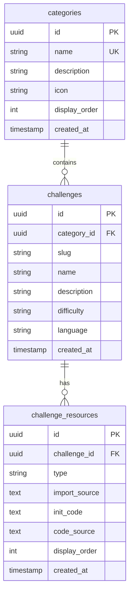

# Challenge 资源子表实施计划

## 需求概述

为挑战系统添加子表来管理每个挑战所需的资源，支持不同技术类型（HTML/React/Vue）及其依赖代码。

## 现有结构

### categories 表

| 字段             | 类型        | 说明   |
| -------------- | --------- | ---- |
| id             | UUID      | 主键   |
| name           | VARCHAR   | 分类名称 |
| description    | TEXT      | 分类描述 |
| icon           | VARCHAR   | 分类图标 |
| display\_order | INTEGER   | 显示顺序 |
| created\_at    | TIMESTAMP | 创建时间 |

### challenges 表

| 字段           | 类型        | 说明     |
| ------------ | --------- | ------ |
| id           | UUID      | 主键     |
| category\_id | UUID      | 外键     |
| slug         | VARCHAR   | URL 标识 |
| name         | VARCHAR   | 挑战名称   |
| description  | TEXT      | 挑战描述   |
| difficulty   | VARCHAR   | 难度等级   |
| language     | VARCHAR   | 语言版本   |
| created\_at  | TIMESTAMP | 创建时间   |

## 新增结构设计

### challenge\_types 枚举表（可选，或使用 ENUM 类型）

* html

* react

* vue

### challenge\_resources 子表

| 字段             | 类型          | 说明                  |
| -------------- | ----------- | ------------------- |
| id             | UUID        | 主键                  |
| challenge\_id  | UUID        | 外键 → challenges.id  |
| type           | VARCHAR(20) | 类型：html, react, vue |
| import\_source | TEXT        | esm.sh 依赖引用代码       |
| init\_code     | TEXT        | 初始代码模板              |
| code\_source   | TEXT        | 最终源码                |
| display\_order | INTEGER     | 显示顺序                |
| created\_at    | TIMESTAMP   | 创建时间                |

## 关系设计



## esm.sh 依赖引用设计

根据 esm-expert skill，依赖引用示例：

```typescript
// React 类型
import_source: `
import React from "https://esm.sh/react@19";
import ReactDOM from "https://esm.sh/react-dom@19/client";
`

// Vue 类型
import_source: `
import { createApp } from "https://esm.sh/vue@3";
`

// HTML 类型（无需依赖）
import_source: ``
```

## 实施步骤

### 步骤 1: 更新 schema.ts

* 在 challenges 表添加 type 字段（可选，因为已有子表）

* 创建 challenge\_resources 表

* 添加外键关系

* 添加索引优化查询

### 步骤 2: 更新 queries.ts

* 添加 challenge\_resources 相关查询函数

* 支持按 type 查询资源

### 步骤 3: 更新 seed.ts

* 添加示例数据，包含 HTML/React/Vue 三种类型的资源

### 步骤 4: 生成迁移并推送

* 运行 `bun run db:generate`

* 运行 `bun run db:push`

### 步骤 5: 验证构建

* 运行 `bun run build` 确认无错误

## 示例数据设计

```typescript
// HTML 挑战资源
{
  challenge_id: xxx,
  type: 'html',
  import_source: '',
  init_code: '<form>...</form>',
  code_source: '完整表单验证代码'
}

// React 挑战资源
{
  challenge_id: xxx,
  type: 'react',
  import_source: `import React from "https://esm.sh/react@19"`,
  init_code: 'function App() { return <div>...</div> }',
  code_source: '完整 React 组件代码'
}

// Vue 挑战资源
{
  challenge_id: xxx,
  type: 'vue',
  import_source: `import { createApp } from "https://esm.sh/vue@3"`,
  init_code: '<template>...</template>',
  code_source: '完整 Vue 组件代码'
}
```

## 预期效果

* 每个挑战可以包含多种类型（HTML/React/Vue）的代码资源

* 前端可以根据用户选择加载对应类型的代码进行练习

* 支持 esm.sh CDN 方式加载依赖

